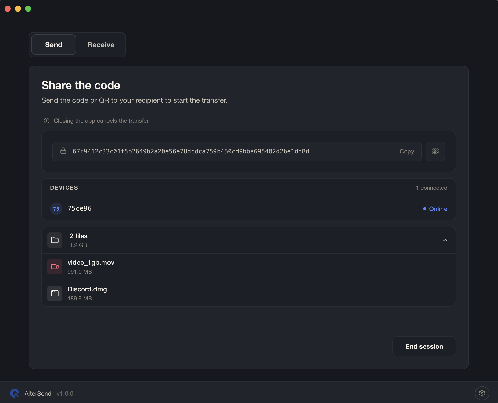
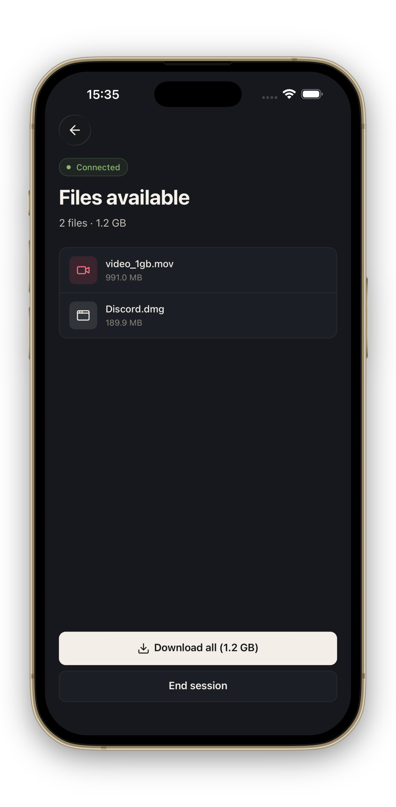

<div align="center">
  

  ### File transfer without the cloud.

  Files go directly between your devices — end-to-end encrypted, no accounts, no servers, no limits.

  [](LICENSE)
  [](#download)

  [Website](https://altersend.com) · [Download](https://altersend.com/download) · [Discord](https://discord.gg/R6tmrk85Vx)

  <br/>

  
  &nbsp;
  

</div>

---

## Contents

- [About](#about)
- [Features](#features)
- [Download](#download)
- [How it works](#how-it-works)
- [For developers](#for-developers)
  - [Prerequisites](#prerequisites)
  - [Setup](#setup)
  - [Run](#run)
  - [Build](#build)
  - [Project structure](#project-structure)
  - [Tech stack](#tech-stack)
  - [Crash reporting](#crash-reporting)
- [Contributing](#contributing)
- [Security](#security)
- [License](#license)

## About

AlterSend is a free, open-source app for sending files directly between your devices — no cloud, no uploads, no size limits. Files transfer peer-to-peer and are end-to-end encrypted; nothing is ever stored on a server.

Why use WeTransfer, Dropbox, or Google Drive when you can send files directly — instantly, privately, with no upload costs and no limits?

## Features

- **No accounts** — no signup, no login, no email address required
- **No servers** — files transfer directly device-to-device, nothing stored in the cloud
- **End-to-end encrypted** — only your devices can read your files, always
- **No file size limit** — send a 100 MB photo or 500 GB video archive, same experience
- **Cross-platform** — macOS, Windows, Linux, iOS, Android
- **Works everywhere** — local network or across continents, same code path
- **Open source** — Apache-2.0, audit every line yourself

## Download

Get the latest release from [altersend.com/download](https://altersend.com/download) or directly from the table below.

| Platform | Download |
|---|---|
| **Windows** | [Microsoft Store](https://apps.microsoft.com/detail/9NHLK9GLVDLW) (signed) · [EXE installer](https://github.com/denislupookov/altersend/releases/latest) |
| **macOS** | [DMG — Apple Silicon](https://github.com/denislupookov/altersend/releases/latest) · [DMG — Intel](https://github.com/denislupookov/altersend/releases/latest) |
| **Linux** | [AppImage](https://github.com/denislupookov/altersend/releases/latest) |
| **Android** | [Google Play](https://play.google.com/store/apps/details?id=com.altersend.mobile) · [APK](https://github.com/denislupookov/altersend/releases/latest) |
| **iOS** | [App Store](https://apps.apple.com/us/app/altersend-file-transfer/id6772496271) |

> **macOS `.dmg`** — signed with our Developer ID but not yet notarized by Apple, so macOS will show "AlterSend cannot be opened because the developer cannot be verified" on first launch. **Right-click the app → Open → Open** to bypass Gatekeeper (one time only). Notarization is in progress.

> **Windows `.exe`** — not yet signed, so Windows will show "Windows protected your PC" on first run. Click **More info → Run anyway** to install. The Microsoft Store version is signed and avoids this warning.

## How it works

1. Open AlterSend on both devices
2. One device shows a **join code** (or QR)
3. The other scans or types it
4. Files transfer directly — peer to peer

```
   ┌─────────┐          encrypted P2P          ┌─────────┐
   │ Device  │ ◄──────────────────────────────► │ Device  │
   │   A     │     direct, no middleman         │   B     │
   └─────────┘                                  └─────────┘
        ▲                                            ▲
        │       peer discovery via Hyperswarm        │
        └────────────────────────────────────────────┘
                   (DHT, no central server)
```

Discovery uses [Hyperswarm](https://github.com/holepunchto/hyperswarm) (a DHT) — once peers find each other, no central infrastructure is involved. Transfers run over [Hyperdrive](https://github.com/holepunchto/hyperdrive): encrypted, content-addressed, resumable.

---

## For developers

### Prerequisites

- Node.js 20+
- npm 10+
- Xcode (iOS) or Android Studio (Android)

### Setup

```sh
git clone https://github.com/denislupookov/altersend.git
cd altersend
npm install

cp apps/desktop/.env.example apps/desktop/.env
cp apps/mobile/.env.example apps/mobile/.env
# All env vars are optional in dev — the app runs without them.
```

### Run

```sh
npm run dev            # desktop (Electron)
npm run mobile:start   # mobile (Expo)
```

### Build

```sh
npm run desktop:build  # packages + desktop app
```

Platform installers (`.dmg`, `.exe`, `.AppImage`) are produced by the release CI workflow — trigger manually from the Actions tab.

### Project structure

```
apps/
  desktop/    Electron app — main + renderer + Bare worklet
  mobile/     React Native / Expo app
packages/
  core/       P2P protocol — Hyperswarm, Hyperdrive, RPC
  domain/     State management — Zustand store, business logic
  components/ Cross-platform UI — React Strict DOM + Tailwind
docs/
  architecture.md   Full system overview
```

See [docs/architecture.md](docs/architecture.md) for data flow and inter-process boundaries.

### Tech stack

[Electron](https://electronjs.org) · [React Native](https://reactnative.dev) · [Expo](https://expo.dev) · [Bare](https://bare.pears.com) · [Hyperswarm](https://github.com/holepunchto/hyperswarm) · [Hyperdrive](https://github.com/holepunchto/hyperdrive) · [React Strict DOM](https://github.com/facebook/react-strict-dom) · [Tailwind](https://tailwindcss.com) · [Zustand](https://github.com/pmndrs/zustand)

### Crash reporting

Crash and error reporting uses [Sentry](https://sentry.io). It is **opt-in and off by default** — nothing is sent until you enable it in the app's settings.

- **Where it runs.** Desktop has two Sentry SDKs: `@sentry/electron/main` for native main-process crashes and `@sentry/electron/renderer` for renderer JS / transfer errors. Mobile uses `@sentry/react-native`. The Bare worklet has no Sentry — it pipes its logs to the renderer over RPC instead.
- **Opt-in state.** Stored locally: desktop uses the `localStorage` key `altersend.crash-reporting.enabled`; mobile uses a marker file in the app document directory. The main process initializes Sentry early (before `app` ready) but gates submission in `beforeSend`; the renderer pushes the current preference over the `sentry:setEnabled` IPC channel.
- **PII scrubbing.** `beforeSend` rewrites home-directory paths to `~` in exception messages and breadcrumbs, so usernames and file paths don't leak into stack traces.
- **DSNs come from env vars** — `SENTRY_DSN` (desktop main, baked in at build by `gen-sentry-dsn.cjs`), `VITE_SENTRY_DSN` (desktop renderer), `EXPO_PUBLIC_SENTRY_DSN` (mobile). All are optional; see the `.env.example` files. **Community and self-built binaries ship without DSNs, so Sentry is a complete no-op and no telemetry is ever sent.**

---

## Contributing

Pull requests welcome. See [CONTRIBUTING.md](CONTRIBUTING.md) for setup, code style, and the PR process.

## Security

Found a vulnerability? Follow the disclosure process in [SECURITY.md](SECURITY.md) — please don't open a public issue.

## License

[Apache-2.0](LICENSE) © AlterSend
